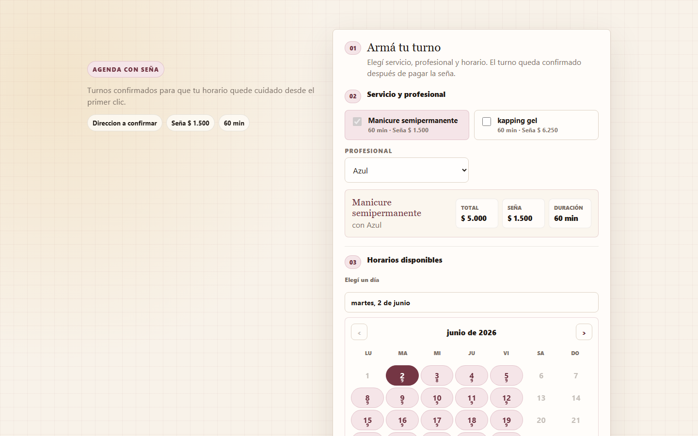
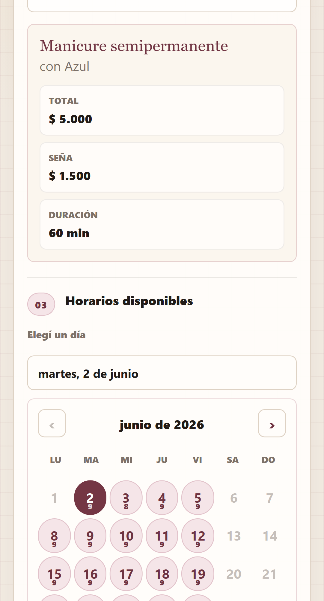
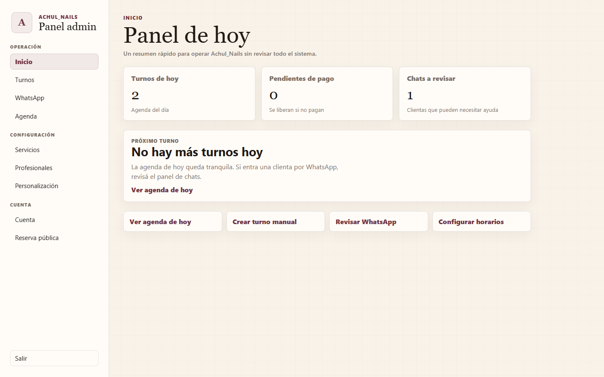
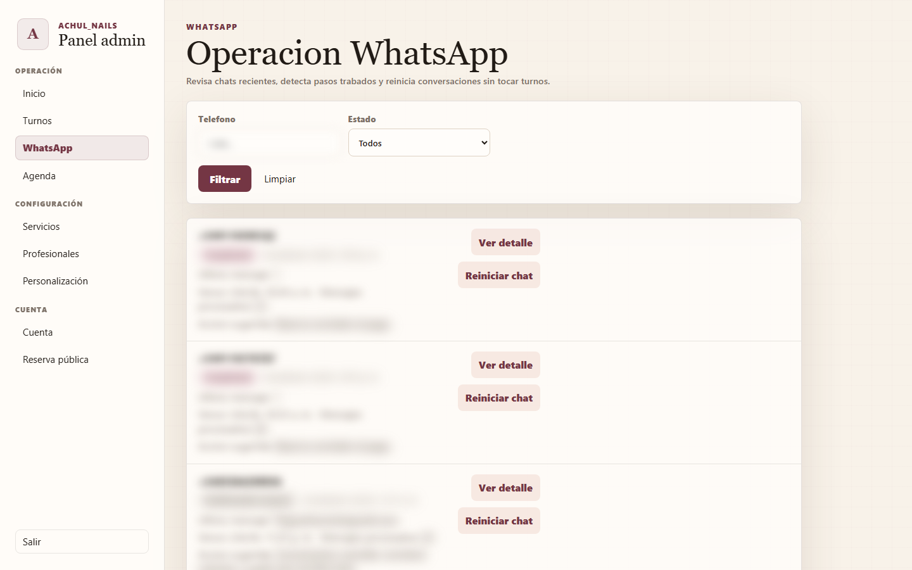
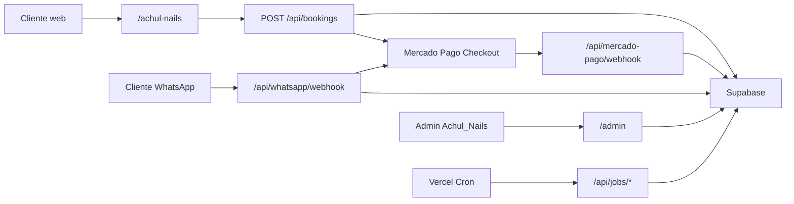

# Sistema de Turnos Automatizados

Sistema web para gestionar reservas de turnos con seña, pensado inicialmente para **Achul_Nails** y negocios de estética que quieren reducir inasistencias sin sumar fricción operativa.

El producto combina reserva pública, pagos con Mercado Pago, panel admin, agenda, WhatsApp automatizado y pruebas E2E para dejar el flujo listo para un piloto real controlado.

## Demo

- Producción: [https://turnos-estetica.vercel.app](https://turnos-estetica.vercel.app)
- Reserva pública piloto: [https://turnos-estetica.vercel.app/achul-nails](https://turnos-estetica.vercel.app/achul-nails)
- Admin: [https://turnos-estetica.vercel.app/admin/login](https://turnos-estetica.vercel.app/admin/login)

## Capturas

### Reserva pública



### Calendario mobile



### Panel admin



### Operación WhatsApp



## Funcionalidades

- Reserva pública con calendario mensual, selección de día y horarios disponibles.
- Reservas multi-servicio en un único turno consecutivo.
- Cálculo automático de duración, total, seña y saldo restante.
- Checkout Pro de Mercado Pago para cobrar la seña.
- Exclusión de efectivo offline en checkout público.
- Panel admin con login real vía Supabase Auth.
- Dashboard operativo con turnos del día, pendientes de pago y chats a revisar.
- Gestión de servicios, profesionales, horarios y bloqueos de agenda.
- Creación manual de turnos sin seña o con seña recibida en efectivo en el local.
- Detalle del turno, cambio de estado, cancelación y reprogramación segura.
- WhatsApp bot con Meta Cloud API: selección guiada de servicios, profesional, día, horario y link de pago.
- Panel admin de WhatsApp para ver conversaciones trabadas y reiniciarlas sin tocar pagos ni turnos.
- Expiración de holds pendientes para liberar horarios abandonados.
- Auditoría pre-piloto con Playwright en desktop y mobile.

## Stack

- **Next.js 14 App Router**
- **TypeScript**
- **React**
- **Supabase Cloud**
- **Supabase Auth**
- **Mercado Pago Checkout Pro**
- **Meta WhatsApp Cloud API**
- **Resend**
- **Vercel**
- **Vitest**
- **Playwright**

## Arquitectura general



## Flujos principales

### Reserva web

1. La clienta entra a `/achul-nails`.
2. Elige uno o más servicios.
3. Elige profesional.
4. Selecciona día en calendario y horario disponible.
5. Carga nombre, WhatsApp y email.
6. El sistema crea un turno `pending_payment`.
7. Mercado Pago cobra la seña.
8. El webhook aprobado confirma el turno.
9. El horario deja de aparecer disponible.

### Reserva por WhatsApp

1. La clienta escribe `hola`.
2. El bot muestra servicios con mensajes interactivos.
3. La clienta elige servicio(s), profesional, día y horario.
4. El bot muestra resumen antes de generar el pago.
5. Al confirmar, crea el hold y envía link de Mercado Pago.
6. El efectivo no se acepta por WhatsApp; solo queda para turnos manuales admin.

### Operación admin

1. La admin entra con email y contraseña.
2. Revisa turnos del día.
3. Crea turnos manuales si una clienta reserva en persona.
4. Marca asistencia, no asistencia o cancelación.
5. Reprograma turnos validando disponibilidad.
6. Revisa chats trabados en `/admin/whatsapp`.

## Seguridad pre-piloto

- Admin protegido por Supabase Auth y tabla `business_admins`.
- `ADMIN_API_KEY` queda solo como fallback local/test si `ALLOW_ADMIN_API_KEY_FALLBACK=true`.
- Endpoints admin mutantes rechazan requests cross-origin cuando dependen de cookie/sesión.
- Cron jobs protegidos por `CRON_SECRET`.
- Webhook WhatsApp valida verify token y deduplica `message.id`.
- Webhook Mercado Pago procesa cambios esperados del flujo de pago.
- `.env.local` y secretos están ignorados por Git.

## Configuración local

1. Instalar dependencias:

```bash
npm install
```

2. Crear `.env.local` tomando como base `.env.example`.

Variables principales:

```bash
NEXT_PUBLIC_APP_URL=http://localhost:3000
NEXT_PUBLIC_SUPABASE_URL=
NEXT_PUBLIC_SUPABASE_ANON_KEY=
SUPABASE_SERVICE_ROLE_KEY=

MERCADOPAGO_ACCESS_TOKEN_ACHUL=
MERCADOPAGO_WEBHOOK_SECRET=

WHATSAPP_PROVIDER=fake
WHATSAPP_BUSINESS_SLUG=achul-nails
META_WHATSAPP_PHONE_NUMBER_ID=
META_WHATSAPP_ACCESS_TOKEN=
META_WHATSAPP_VERIFY_TOKEN=

RESEND_API_KEY=
RESEND_FROM_EMAIL=

CRON_SECRET=
E2E_TEST_MODE=
E2E_ADMIN_EMAIL=
E2E_ADMIN_PASSWORD=
```

3. Levantar desarrollo:

```bash
npm run dev
```

4. Abrir:

```text
http://localhost:3000/achul-nails
http://localhost:3000/admin/login
```

## Scripts útiles

```bash
npm run typecheck
npm run lint
npm test
npm run build
npm run test:e2e
npm run test:e2e:ui
```

Supabase Cloud:

```bash
npm run supabase:apply-cloud
npm run supabase:apply-migration -- --file=<migration.sql>
```

Limpieza segura de datos de prueba:

```bash
npm run pilot:cleanup -- --emails=e2e@example.com --phones=+5491100000000
npm run pilot:cleanup -- --emails=e2e@example.com --phones=+5491100000000 --execute=true
```

Provisionar admin piloto:

```bash
npm run pilot:provision-admin -- --email=admin@example.com --password="change-me"
npm run pilot:provision-admin -- --email=admin@example.com --password="change-me" --execute=true
```

## Testing y auditoría

Última auditoría pre-piloto local:

- `npm run typecheck`: aprobado.
- `npm run lint`: aprobado.
- `npm test`: 111 tests aprobados.
- `npm run build`: aprobado.
- `npm run test:e2e`: 16 tests Playwright aprobados en desktop y mobile.

El reporte completo está en [`docs/pre-pilot-audit-report.md`](docs/pre-pilot-audit-report.md).

## Estado del proyecto

El sistema está en estado **pre-piloto sólido** para Achul_Nails:

- listo para prueba real controlada;
- no recomendado todavía para lanzamiento masivo;
- pendiente validar seña real chica en Mercado Pago antes de entregarlo a operación diaria;
- pendiente configurar número real de WhatsApp Business si se van a invitar clientas reales por WhatsApp;
- pendiente configurar Resend real para emails confiables.

## Documentación adicional

- [`docs/HANDOFF.md`](docs/HANDOFF.md)
- [`docs/manual-audit-flow.md`](docs/manual-audit-flow.md)
- [`docs/piloto-achul-nails.md`](docs/piloto-achul-nails.md)
- [`docs/whatsapp-automation.md`](docs/whatsapp-automation.md)
- [`docs/mercado-pago-oauth-phase-2.md`](docs/mercado-pago-oauth-phase-2.md)
- [`docs/notifications-phase-2.md`](docs/notifications-phase-2.md)

## Notas

Este repositorio no debe incluir credenciales reales. Configurar secretos en Vercel, Supabase y Meta desde sus paneles correspondientes.
